# Hylance


Hylance is a lightweight ingress controller that terminates **mTLS** connections and forwards traffic to multiple back-end services. It combines [Hitch](https://github.com/varnish/hitch) for TLS and a tiny Python service for configuration with a custom TCP load balancer.

Extensive usage instructions are available in [documentation.md](documentation.md).

## ✨ Features

- 🔒 **mTLS termination** for secure edge connectivity
- 🚀 **Multi-backend routing** ideal for fleets of IoT devices
- ⚙️ **Kubernetes friendly** config served via HTTP
- 🪶 Minimal footprint with a single container image

## Diagram

```mermaid
graph TD
    Client((🔒 Client))
    Hylance{{Hylance mTLS Proxy}}
    Backend1[(Backend 1)]
    Backend2[(Backend 2)]

    Client -- mTLS --> Hylance
    Hylance -- TCP --> Backend1
    Hylance -- TCP --> Backend2
```



## Better Scenario

Imagine a network of sensors publishing data over TLS. Hylance sits at the edge, handles mutual TLS handshakes, then forwards the decrypted connections to a pool of IoT backends. Each backend can scale independently while clients only see a single secure endpoint.

## Building Balance

Balance lives in the `tcp` directory and can be compiled with:

```sh
make -C tcp
```

## Docker Image

The provided `Dockerfile` builds on top of the official [`hitch`](https://hub.docker.com/_/hitch) image. Balance is compiled in a separate build stage and copied into the final container. Build the image locally with:

```sh
docker build -t hylance:latest .
```

Run the container and mount a configuration file:

```sh
docker run \
  -v $PWD/example-config.yaml:/etc/hylance/hylance.yaml \
  -p 8080:8080 hylance:latest
```

The service exposes two read-only endpoints:

- `GET /config/hitch` – returns the Hitch configuration in JSON.
- `GET /config/balance` – returns the Balance configuration in JSON.

A sample configuration is provided in `example-config.yaml`.
